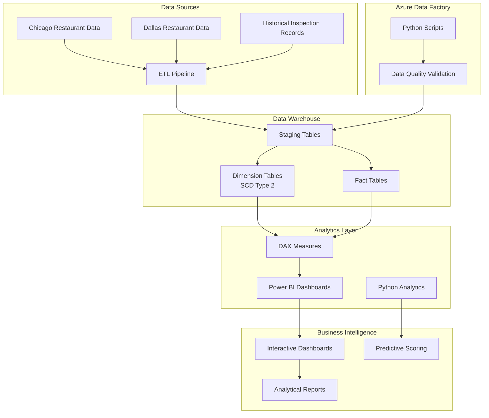

# 🍽️ Restaurant Inspection Analytics

[](https://azure.microsoft.com/en-us/services/data-factory/)
[](https://powerbi.microsoft.com/)
[](https://www.python.org/)
[](https://www.microsoft.com/en-us/sql-server/)

> **Enterprise-scale restaurant inspection analytics platform** leveraging Azure Data Factory, Power BI, dimensional modeling, Python, and SQL to provide comprehensive insights for 50K+ inspection records with automated data quality checks and predictive scoring capabilities.

## 📋 Table of Contents
- [Overview](#overview)
- [Architecture](#architecture)
- [Key Features](#key-features)
- [Technology Stack](#technology-stack)
- [Project Structure](#project-structure)
- [Getting Started](#getting-started)
- [Key Achievements](#key-achievements)
- [Contributing](#contributing)
- [License](#license)

## Overview

This repository contains a comprehensive restaurant inspection analytics project that leverages **Azure Data Factory**, **Power BI**, **dimensional modeling**, **Python**, and **SQL** to provide enterprise-scale analytics for **50K+ inspection records**. The project includes automated data quality checks, star schema dimensional modeling with SCD Type 2, and interactive Power BI dashboards with complex DAX measures for statistical analysis and predictive scoring.

## 🏗️ Architecture



### Architecture Components

| Component | Technology | Purpose |
|-----------|------------|---------|
| **Data Sources** | CSV, JSON, APIs | Raw restaurant inspection data from multiple cities |
| **ETL Pipeline** | Azure Data Factory | Automated data extraction, transformation, and loading |
| **Data Quality** | Python Scripts | Comprehensive validation and quality checks |
| **Data Warehouse** | SQL Server | Star schema with SCD Type 2 for historical tracking |
| **Analytics Engine** | DAX, Python | Complex measures and statistical analysis |
| **Visualization** | Power BI | Interactive dashboards and reports |
| **Predictive Analytics** | Python ML | Risk scoring and predictive insights |

## 🚀 Key Features

- **📊 Enterprise Scale**: Process 50K+ restaurant inspection records
- **🔄 Automated ETL**: Azure Data Factory pipelines with scheduling
- **✅ Data Quality**: Python-based validation and quality checks
- **📈 Star Schema**: Dimensional modeling with SCD Type 2
- **📊 Advanced Analytics**: Complex DAX measures for statistical analysis
- **🎯 Predictive Scoring**: ML-based risk assessment
- **📱 Interactive Dashboards**: User-friendly Power BI visualizations
- **🔄 Real-time Updates**: Automated data refresh capabilities

## Technology Stack

| Category | Technology | Purpose |
|----------|------------|---------|
| **ETL** | Azure Data Factory | Data pipeline orchestration |
| **Database** | SQL Server | Data warehouse and analytics |
| **Visualization** | Power BI | Interactive dashboards |
| **Programming** | Python | Data validation and ML |
| **Modeling** | Star Schema | Dimensional data modeling |
| **Analytics** | DAX | Business intelligence measures |

## 📁 Project Structure

```
Final_Project_Organized/
├── 📋 01_Documentation/           # Project documentation and reports
├── 📊 02_Data_Profiling/          # Data profiling analysis and reports
├── 🔄 03_Data_Staging/            # Data staging workflows and DDL scripts
├── 🏗️ 04_Dimensional_Modeling/    # Dimensional data models and schemas
├── ⚙️ 05_ETL_Workflows/           # ETL workflows and Azure Data Factory
├── 📈 06_Visualizations/          # Power BI and Tableau visualizations
├── 💾 07_SQL_Scripts/             # SQL scripts and queries
├── 📋 08_Reports/                 # Business requirements and reports
├── 📄 Contrib_Factr_Look_Up.csv   # Lookup file for data transformation
└── 📖 README.md                   # Project documentation
```

### 📋 01_Documentation/
Contains all project documentation and reports:
- `Food Inspection - Analysis Report.pdf` - Comprehensive analysis report
- `Food Inspection - Problem Statement.pdf` - Project problem statement
- `Report and Mapping Document.xlsx` - Data mapping and reporting documentation

### 📊 02_Data_Profiling/
Contains data profiling analysis and reports:
- **YData Profiling/** - Food inspection data profiling results
- **Data Profiling - ydata profiling/** - Vehicle crash data profiling results
  - Austin crash report analysis
  - Chicago vehicle crash analysis  
  - New York motor vehicle collision analysis

### 🔄 03_Data_Staging/
Contains data staging workflows and DDL scripts:
- **Stage Table - DDL Scripts/** - SQL DDL scripts for staging tables
- **Stage Table - Workflow/** - Azure Data Factory workflow screenshots
- **Data Staging - Staging tables/** - Comprehensive staging workflows
  - Austin, Chicago, and NYC data staging processes
  - Lookup file mappings
  - Merged staging tables

### 🏗️ 04_Dimensional_Modeling/
Contains dimensional data models and schemas:
- `Dimensional Data Model.ndm2` - Dimensional model file
- `Dimensional_Data_Model_DDL.sql` - SQL DDL for dimensional model
- `Dimensional Data Model.png` - Visual representation of the model
- **Dimensional Model/** - Additional dimensional modeling artifacts

### ⚙️ 05_ETL_Workflows/
Contains ETL (Extract, Transform, Load) workflows:
- `Staging Table Talend Workflow.zip` - Azure Data Factory workflow for staging
- **Dimensions & Fact - Workflow/** - Individual dimension and fact table workflows
- **Talend Project/** - Complete Azure Data Factory project with all ETL jobs

### 📈 06_Visualizations/
Contains business intelligence visualizations:
- **Visualizations/** - Food inspection visualizations
  - Power BI dashboard files (.pbix)
  - Tableau workbook files (.twb, .twbx)
- **Power BI/** - Vehicle crash analysis Power BI files
- **Tableau/** - Vehicle crash analysis Tableau files

### 💾 07_SQL_Scripts/
Contains all SQL scripts and queries:
- **SQL Queries/** - Visualization and analysis queries
- **Dimensions & Fact - DDL Scripts/** - Dimension and fact table DDL
- `Validation_Scripts.sql` - Data validation and testing scripts

### 📋 08_Reports/
Contains business requirements and reports:
- **Business Requirements /** - Business requirement screenshots and reports

### 📄 Contrib_Factr_Look_Up.csv
Lookup file for contributing factors mapping used in data transformation.

## 🚀 Getting Started

### Prerequisites
- Azure Data Factory access
- SQL Server instance
- Power BI Desktop
- Python 3.8+
- Required Python packages (see requirements.txt)

### Installation
1. Clone this repository
```bash
git clone https://github.com/SangramSA/restaurant-inspection-analytics.git
cd restaurant-inspection-analytics
```

2. Set up Azure Data Factory environment
3. Configure SQL Server connection
4. Install Power BI Desktop
5. Run data profiling scripts

### Quick Start
1. Review the documentation in `01_Documentation/`
2. Examine data profiling results in `02_Data_Profiling/`
3. Understand the data staging process in `03_Data_Staging/`
4. Explore the star schema dimensional model in `04_Dimensional_Modeling/`
5. Review ETL workflows in `05_ETL_Workflows/` for Azure Data Factory pipelines
6. View interactive Power BI dashboards in `06_Visualizations/`
7. Execute SQL scripts in `07_SQL_Scripts/` for data validation and analysis

## 🏆 Key Achievements

### Enterprise-Scale Analytics
- **50K+ Records**: Successfully processed and analyzed over 50,000 restaurant inspection records
- **Star Schema Design**: Implemented comprehensive dimensional model with SCD Type 2 for historical tracking
- **Automated Data Quality**: Built comprehensive data validation using Azure Data Factory and Python scripts

### Advanced Analytics Capabilities
- **Complex DAX Measures**: Developed sophisticated Power BI measures for statistical analysis
- **Predictive Scoring**: Implemented predictive analytics for restaurant inspection risk assessment
- **Interactive Dashboards**: Created user-friendly Power BI visualizations for business stakeholders

## 📊 File Types

| Extension | Description |
|-----------|-------------|
| **.pbix** | Power BI dashboard files with complex DAX measures |
| **.twb/.twbx** | Tableau workbook files |
| **.sql** | SQL scripts for data validation and analysis |
| **.ndm2** | Dimensional model files (Star Schema with SCD Type 2) |
| **.zip** | Azure Data Factory workflow archives |
| **.pdf** | Analysis reports and documentation |
| **.xlsx** | Data mapping and validation documents |
| **.html** | Data profiling reports |
| **.py** | Python scripts for data quality validation |

## 🤝 Contributing

We welcome contributions! Please feel free to submit a Pull Request. For major changes, please open an issue first to discuss what you would like to change.

### Contributing Guidelines
1. Fork the repository
2. Create a feature branch (`git checkout -b feature/AmazingFeature`)
3. Commit your changes (`git commit -m 'Add some AmazingFeature'`)
4. Push to the branch (`git push origin feature/AmazingFeature`)
5. Open a Pull Request

## 📄 License

This project is licensed under the MIT License - see the [LICENSE](LICENSE) file for details.

## 📞 Contact

- **Project Link**: [https://github.com/SangramSA/restaurant-inspection-analytics](https://github.com/SangramSA/restaurant-inspection-analytics)
- **GitHub Profile**: [https://github.com/SangramSA](https://github.com/SangramSA)

## 🙏 Acknowledgments

- Azure Data Factory for ETL orchestration
- Power BI for advanced visualizations
- SQL Server for data warehousing
- Python community for data validation libraries 